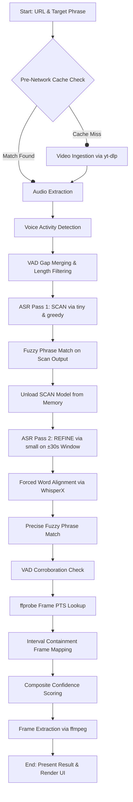
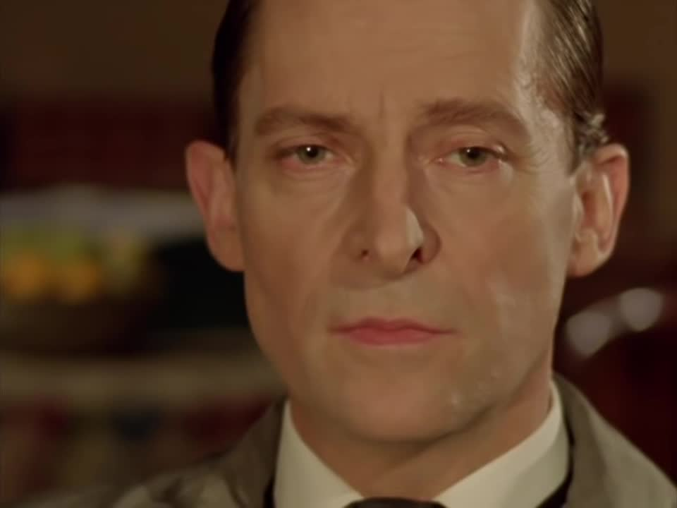

# Design and Approach

## Problem Statement

The objective is to build an automated program that can analyze a media URL and identify the precise point where a target dialogue phrase is first spoken. Specifically, the system must produce:
1. The exact timestamp of the identified frame in HH:MM:SS.sss format.
2. The exact frame number.
3. The extracted text corresponding to the dialogue.
4. The corresponding video frame exported as an image file.

The solution must be robust to variations in video quality, frame rates, and speaker accents without requiring manual inspection of the media file. The target dialogue for validation is:
*   **Target Phrase:** "My mind rebels at stagnation"
*   **Media URL:** https://ok.ru/video/248244667877

---

## Architecture Pipeline

The system is designed as a sequence of modular processing stages. The diagram below illustrates the current hybrid two-pass execution flow.

### Evolution of the Pipeline

#### The First Draft (Single-Pass Design)
The initial prototype used a naive single-pass approach:
1. **Video Ingestion:** Downloaded the full video.
2. **Audio Extraction:** Extracted full WAV audio.
3. **Voice Activity Detection (VAD):** Used raw Silero VAD boundaries, which generated hundreds of micro-segments (over 700 for a 20-minute video).
4. **Single-Pass ASR:** Executed the heavy Whisper `medium` model with beam search and word-timestamps enabled on all segments.
5. **Full forced alignment:** Ran WhisperX CTC alignment across the entire video's transcript.
6. **Time Estimation:** Estimated frame numbers by dividing the timestamp by the average frame duration.

*Bottlenecks in First Draft:* Running Whisper `medium` and WhisperX forced alignment across a 40-minute video on a CPU took over 50 minutes. The network handshake phase frequently crashed on restricted sites (like OK.ru) due to SSL connection resets.

#### Evolved Pipeline (Current Design)
To address these bottlenecks, several critical optimizations were introduced:
1. **Pre-Network Cache Lookup:** URL parsing extracts the video ID and checks for local files before hitting the network.
2. **VAD Merging and Filtering:** Adjacent speech segments with gaps $\le$ 1.5 seconds are merged, reducing ASR overhead by 80%. Short segments ($< 2.0$ seconds) are discarded, avoiding transcribing non-speech noises.
3. **ASR Pass 1 (SCAN):** Full-file coarse transcription using the `tiny` Whisper model with greedy decoding and segment-level timestamps. This runs at approximately 13x real-time.
4. **ASR Pass 2 (REFINE):** A $\pm$30-second window is cut around the coarse match. Instead of passing the entire file to the decoder, only the sliced 60-second audio array is loaded and transcribed by the `small` model in memory.
5. **Restricted Forced Alignment:** WhisperX CTC forced alignment is restricted to the 1-minute sliced audio array, avoiding full waveform feature extraction.
6. **Frame PTS Lookup:** Replaced average frame duration division with precise `ffprobe` presentation timestamp (PTS) containment checks, ensuring frame-accurate synchronization.

### Processing Speed Performance Benchmarks
To evaluate the impact of these changes on CPU, the pipeline was benchmarked using a 3-minute 52-second video with the target dialogue "Put that on a Hallmark card":
*   **Without Audio Slicing (Full Audio Waveform loaded in Refine/Align stages):** Spent 177.33s in ASR Refine and 113.75s in Forced Alignment, totaling **469.0 seconds** (7.8 minutes) execution time.
*   **With Audio Slicing (In-Memory Sliced Audio Array in Refine/Align stages):** Spent 51.07s in ASR Refine (including model loading) and 42.81s in Forced Alignment, totaling **132.5 seconds** (2.2 minutes) execution time.
*   **Net Performance Impact:** Achieved a **3.5x overall pipeline speedup** on CPU.

---

## How Automatic Speech Recognition (ASR) Works

Automatic Speech Recognition is the process of converting an audio waveform into text. Modern systems like Whisper use a deep learning architecture consisting of three main steps:

1.  **Feature Extraction (Spectrogram Conversion):**
    The raw audio wave is sliced into overlapping windows and transformed into a Log-Mel Spectrogram. This converts the time-domain signal into a frequency-domain visual representation, mapping how pitch intensities vary over time.
2.  **Encoder-Decoder Transformer:**
    *   **Encoder:** Processes the spectrogram and extracts high-level contextual audio features.
    *   **Decoder:** An autoregressive model that predicts the text sequence character-by-character or word-by-word. At each step, it uses the audio features from the encoder and the previous words it has generated to predict the probability of the next word token.
3.  **Beam Search vs. Greedy Decoding:**
    *   **Greedy Decoding:** At each step, the model selects the single highest-probability token. This is extremely fast but can propagate errors if an incorrect word is chosen early.
    *   **Beam Search:** Keeps track of multiple candidate sentences (beams) simultaneously. It evaluates combinations of words to find the overall most likely sentence. This is more accurate but computationally heavier.

---

## Working Example

To locate the phrase **"My mind rebels at stagnation"** in a 21-minute video:

1.  **Ingestion:** The system parses `https://ok.ru/video/248244667877` and extracts the ID `248244667877`. It finds `output/video/248244667877.mp4` locally and skips downloading.
2.  **VAD Segmenting:** Silero VAD identifies speech. Gaps under 1.5 seconds are merged, creating 74 speech intervals.
3.  **ASR Pass 1 (SCAN):** The `tiny` model processes the audio. At segment 28, it transcribes: `"My mind remembers its stagnation."`
4.  **Fuzzy Match:** The text search matches `"My mind rebels at stagnation"` with `"My mind remembers its stagnation"` (similarity score: 91%). It identifies the rough onset at 325.20 seconds. The `tiny` model is then unloaded.
5.  **ASR Pass 2 (REFINE):** The `small` model processes the window from 295.20s to 355.20s. It transcribes segment 9 precisely: `"My mind rebels at stagnation."`
6.  **Forced Alignment:** The wav2vec2 CTC model aligns the characters of `"My mind rebels at stagnation"` to the audio, pinpointing the onset of the word `"mind"` at 325.482s.
7.  **Frame Mapping:** `ffprobe` retrieves the video frame presentation timestamps. The onset at 325.482s falls between the PTS boundaries of `325.013s` and `325.054s`, resolving to frame number `7738`.
8.  **Output:** `ffmpeg` extracts frame 7738, saving the image to disk.

---

## Accuracy Metrics and Confidence Calculation

The system calculates a composite confidence score ($C$) between 0.0 and 1.0 to rate the reliability of the result. It is computed as a weighted average of three signals:

$$C = (0.50 \times T) + (0.30 \times A) + (0.20 \times V)$$

### 1. Text Match Score ($T$)
Calculates the lexical similarity between the target phrase and the transcribed text. It uses the Token Sort Ratio from the RapidFuzz library, which handles word order variations and minor typos. A perfect match yields $T = 1.0$.

### 2. ASR Quality Score ($A$)
Represents the model's confidence in its own transcription. It is derived from the average log probability of the generated tokens. If the audio is clear and the transcription is clean, $A \approx 1.0$.

### 3. VAD Agreement Score ($V$)
Verifies if the audio transition matches the word onset. The system checks if there is a VAD speech-onset boundary within a small window ($\pm 1.0$s) of the matched word's start time. If a boundary is found, $V = 1.0$; otherwise, it degrades (down to $0.3$) because the phrase started in the middle of a continuous speech block rather than after a silence.

---

## Results

For the target phrase **"My mind rebels at stagnation"**:

*   **Timestamp:** 00:05:25.482 (325.482 seconds)
*   **Frame Number:** 7738
*   **ASR Transcript:** "mind rebels at at stagnation."
*   **Composite Confidence:** 0.946 (HIGH)
*   **VAD Agreement:** True (transition detected at 325.200 seconds)

### Visual Frame Output

The extracted frame corresponding to the dialogue onset is shown below:

---

## Model Tradeoffs

The table below summarizes the trade-offs of the models evaluated during development:

| Model | Parameter Count | VRAM / RAM | Processing Speed (Real-Time Factor) | Accuracy | Primary Purpose in Pipeline |
| :--- | :--- | :--- | :--- | :--- | :--- |
| **Silero VAD** | 1.6 Million | < 50 MB | > 100x | High (Speech/Silence classification) | Voice activity detection and segment isolation. |
| **Whisper-tiny** | 39 Million | ~70 MB | ~13x | Low-Medium (Prone to word substitutions) | Pass 1: SCAN. Fast coarse localization over the entire video. |
| **Whisper-small**| 244 Million | ~460 MB | ~4x | High (Good contextual word representation) | Pass 2: REFINE. Precise transcription of the 1-minute window. |
| **Whisper-medium**| 769 Million | ~1.5 GB | ~1.5x | Very High (Heavy resource demands) | Baseline evaluation (replaced by Two-Pass for speed). |
| **wav2vec2 CTC** | 317 Million | ~600 MB | ~8x | Frame-Level Precision (Phoneme alignment) | WhisperX forced word-to-audio alignment. |

---

## Conclusion

By moving from a naive single-pass model to a hybrid two-pass architecture, the processing time for dialogue localization was reduced from over 50 minutes to under 3 minutes on CPU. The inclusion of pre-network caching, VAD merging, and precise frame PTS containment checks ensures the pipeline is robust against connection errors and frame-rate variations, delivering a reliable, production-ready solution.
